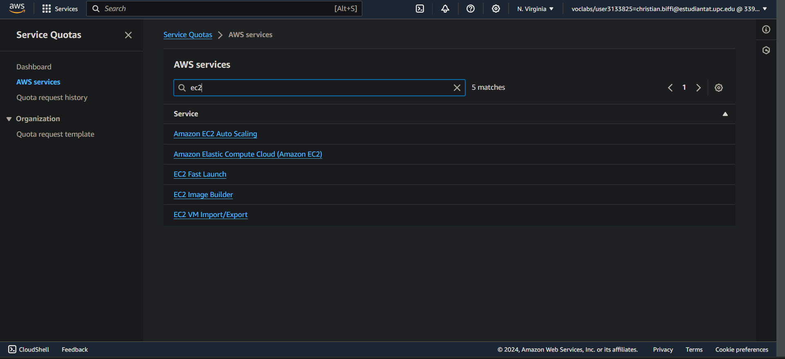

## Task 3.1
This lab offers an introduction to AWS IAM. AWS Identity and Access Management (IAM) allows users to manage access for IAM Users, Roles, and federated users.
\
We simply started by going to the Services menu, selected IAM after searching the search bar, then we entered the Users pane where we could see that there had been 3 users created by default for us, user-1, user-2 and user-3.\
By choosing user-1 we could see that it did not have any permissions assigned, so we went to the Groups tab, seeing that the user was not part of any Group.

<details>
  <summary>Click to toggle image</summary>
  
  
  
</details>

Then, by navigating to the User groups pane, we noticed 3 groups present: EC2-Admin, EC2-Support and S3-Support. Further, by selecting the EC2-Support group we could notice that it has a policy for Read Only Access. By looking at the details of this policy we saw that allowed to describe several different informations of an EC2 instance, meaning users part of this policy would not have any write rights over the specified resources, but they could only read information about them. 
Similarly, The S3-Support group has the AmazonS3ReadOnlyAccess policy attached. Finally, the EC2-Admin  is slightly different from the other two. Instead of a Managed Policy, it has an Inline Policy, which is a policy assigned to just one User or Group. This policy grants permission to view information about Amazon EC2 and also the ability to Start and Stop instances.

<details>
  <summary>Click to toggle image</summary>
  
  
  
  
  
  
</details>

Subsequently we were provided with a business scenario that implied adding specific users to appropriate user groups. We show through the below step by step images how we added each user to its appropriate user group so that the right policy would be applied to them and they would have the rights desired by the business.

| User   | In Group    | Permissions                                   |
| ------ | ----------- | -------------------------------------------- |
| user-1 | S3-Support  | Read-Only access to Amazon S3                |
| user-2 | EC2-Support | Read-Only access to Amazon EC2               |
| user-3 | EC2-Admin   | View, Start and Stop Amazon EC2 instances    |

<details>
  <summary>Click to toggle image</summary>
  
  
  
  
  
  
  
</details>

Going further we wanted to test the well-functioning of the above-mentioned rights changes to the different users. We first signed in with user-1 like in the screenshot below, accessing the corresponding AWS interface. By navigating to the Ec2 instances we could notice that no instances were available to us, and we received an error message confirming that the policy works, since this user has not been assigned any EC2 instance privileges.
However by signing in from user-2 we indeed gained access to see the LabHost instance and by trying to stop we were able to confirm again the working of the policies, since this user was granted read-only access to EC2. We also couldn't open the S3 bucket because of our insufficient permissions.

<details>
  <summary>Click to toggle image</summary>
  
  
  
  
  
  
  
  
  
  
  
</details>

By finally logging into user-3 (which has Amazon EC2 admin rights), we could successfully stop the LabHost instance.

<details>
  <summary>Click to toggle image</summary>
  
  
  
</details>

## Task 3.2

We also went through the 5th lab of the "AWS Academy Cloud Foundations" that was about building our VPC and launch a web server.

<details>
  <summary>Click to toggle image</summary>
  
  
</details>

In the first part of the lab we have configured the VPC. We have set it to the us-east-1 region and kept most of the default configurations except for the number of availability zones that we initially set to be 1. Additionally, we have changed the public and private subnets to custom values.
Respectively, we have chosen to have NAT gateways in 1 availability zone and the VPC endpoints set to None.

<details>
  <summary>Click to toggle image</summary>
  
  
</details>

Subsequently, a VPC with public and private subnets in one Availability Zone has been created, each subnet with its own route table. It added an Internet Gateway for public subnet communication and a NAT Gateway for private subnet internet access. The public subnet (CIDR 10.0.0.0/24) routes traffic through the Internet Gateway, while the private subnet (CIDR 10.0.1.0/24) accesses the internet via the NAT Gateway.\
Further we have created an additional public subnet. This subnet will contain all IP addresses starting with 10.0.2.x. We have also created another private subnet. The subnet will have all IP addresses starting with 10.0.3.x.

<details>
  <summary>Click to toggle image</summary>
  
  
</details>

Destination 0.0.0.0/0 points to Target nat-xxxxxxxx, directing internet-bound traffic to the NAT Gateway, which then forwards it to the internet. This route table handles traffic from private subnets.\
We accessed the Subnet associations tab and edited the route table, which we initially created while setting up the VPC and associated with lab-subnet-private-1. Then, we've added lab-subnet-private-2 to this route table by selecting it in the Explicit subnet associations panel and saving the associations.

<details>
  <summary>Click to toggle image</summary>
  
  
</details>

Now our VPC has both public and private subnets set up across two Availability Zones. We also updated the route tables from task 1 to handle network traffic for these new subnets.

<details>
  <summary>Click to toggle image</summary>
  
  
</details>

We went further creating a Web Security Group, essentially functioning as a digital barrier. Upon instance launch, there will link one or multiple security groups with the instance. Within each security group, we are able to incorporate regulations permitting or restricting traffic to and from the instances connected to it. For this task we want to be able to receive HTTP requests over the internet.

<details>
  <summary>Click to toggle image</summary>
  
  
</details>

We then went on to configure an EC2 instance for our webserver, using the public subnet to enable public access to our webpage and assigning the security group previously created.
Then by using the following code:

```shell
#!/bin/bash
# Install Apache Web Server and PHP
dnf install -y httpd wget php mariadb105-server
# Download Lab files
wget https://aws-tc-largeobjects.s3.us-west-2.amazonaws.com/CUR-TF-100-ACCLFO-2/2-lab2-vpc/s3/lab-app.zip
unzip lab-app.zip -d /var/www/html/
# Turn on web server
chkconfig httpd on
service httpd start
```

What our web page does is displaying instance metadata values as seen below:

<details>
  <summary>Click to toggle image</summary>
  
  
</details>

## Task 3.3
This laboratory had the final goal to get familiar with the Amazon EC2 service, to launch and manage a web service.

First of all, after having accessed the AWS console it is possible to simply search using the search bar the service that we need, in this case EC2. In the main page of EC2 is easy to launch a new instance of it by simply pressing the corresponding button.

This action opens the configuration page of our new instance where we can set every aspect of it, where the most important ones are the name, the AMI (that is the machine image that is installed in the instance), the instance type where it is possible to choose the power and size of the hardware based on the requirements of the application, the cryptography used in the login, the network settings and the storage.
In particular in the network settings we are creating a new security group to control the traffic of our instance and eventually add rules to it.
Moreover, we are setting a custom shell script to automatically install and configure an Apache web server as soon as the instance is launched.

<details>
  <summary>Click to toggle image</summary>
  
  
  
  
  
  
  
  
  
  
  
</details>

After having created the instance we need to wait for it to initialize. Selecting the instance that we have created once it is initialized we can monitor all the metrics that AWS provide us, the logs and a screenshot of our instance.

<details>
  <summary>Click to toggle image</summary>
  
  
  
  
  
  
  
  
  
  
</details>

We can now proceed to test if our web server it's working correctly. Accessing the public IP of our EC2 instance we can see that right now a connection error is returned, since we had not configured the security group to accept the incoming traffic on port 80.

<details>
  <summary>Click to toggle image</summary>
  
  
  
</details>

To make it work we need to change the inbound rules of our web security group. In particular we need to add a rule to accept any connection through the HTTP protocol. After adding this rule the web server is now accessed correctly.

<details>
  <summary>Click to toggle image</summary>
  
  
  
  
  
</details>

The next part is useful to understand how it's possible to resize the EC2 instance to fit our needs. First, we need to stop the instance and after it has stopped we can change the instance type to a `t2.small`. We can also add a stop protection for our instance that will avoid the instance to be stopped inadvertently. It is needed to remove this protection later on if we want to effectively stop the instance. The last thing that we can do while the instance is stopped is resizing the EBS volume and restart the instance.

<details>
  <summary>Click to toggle image</summary>
  
  
  
  
  
  
  
  
  
</details>

The laboratory now let us see the limits of our EC2 instance, in particular it focuses on the running on-demand limits. We can notice that there are a lot of different limits that we need to monitor and be sure to not exceed, but eventually there is the possibility as AWS account owner to request an increase of many of these.

<details>
  <summary>Click to toggle image</summary>
  
  
  
</details>

Finally, as last task we can test if the stop protection that we have set before is woring correctly. In order to test this we can try to stop it as we have done before from the "instance state" menù, but as we can notice now we the instance is not stopped and we visualize an error. To be able to stop the instance we need to remove first the stop protection and then we can correctly stop it.

<details>
  <summary>Click to toggle image</summary>
  
  
  
  
</details>


## Task 3.4 - 3.5
Since it is not more possible to use AWS Comprehend with the free laboratory environment we used AWS Rekognition to achieve a similar results.

In particular our idea was to use the power of object recognition offered by the service to help the user recognize if it has all the necessary ingredients for a recipe that it wants to do.

First of all, we started the laboratory environment through "AWS Academy Learner Lab". After it was all set up using the AWS console we searched the Rekognition service to have a better understanding of how it worked. Inside the page of the service are present different demos that shows the capabilities of it, we were in particular interested in trying the labels recognition inside an image.

We tried to upload different images of fridges full of ingredients, but the results were not very great both because the labels returned were very few and also because there were very general labels we were not interested in, such as "Device", "Refrigerator" or "Shelf".

Looking through the [docs](https://docs.aws.amazon.com/rekognition/latest/dg/labels-detect-labels-image.html) of the service we saw that was possible to set some parameters that could have helped us to restrict the results of the recognition, in particular it is possible to set a lower confidence boundary and a category inclusion list. Searching through the available categories we found that there is a category called "Food and Beverage" that was exactly what we needed for our little project.

We then started to set up the environment inside the lab, in particular we created the personal access token from our GitHub profile to access through the AWS Learner Lab. After having created the personal access token, we cloned the project inside our environment.

The python script is inside the file `objectRecognition.py`, where first of all the ingredients necessary for the recipe are requested to the user, then with a function it connects using the AWS api at our console using the service rekognition. After this, the script opens the image uploaded by the user inside the folder of the script (renaming it "Fridge.jpg") and finally calls the Rekognition service passing the image object, the maximum labels, the minimum confidence and the category inclusion list.
When the response is available the script prints all the object recognized with their confidence and loop through the ingredients inserted by the user to check if they are inside the fridge or not.


We have noticed that the recognition results widely varies based on the image uploaded, but this is something that we cannot control. It is for sure an interesting service that can be used in a variety of use cases and could be personalized even more to fit the specific needs of the application.

At first, it was quite difficult to understand how exactly the call at the service worked since we needed to set up the AWS credentials on our PC or push every little change to test it directly in the Learner Lab that had everything already set up for us. After that the use of the API was pretty straightforward for our particular use case and it was needed only to understand how the parameters worked.

In total the implementation and the writing of the report for this task took us around 4 hours of work.

### Conclusion

The three laboratory were very useful to gain practice with how the AWS console and services works hand-on, they were simple to follow and understand as they are clearly explained in every step. The most difficult part of the laboraory was in the implementation of a use-case using AWS Rekognition, this because we needed some time to understand correctly how the system worked and how was possible to use it connecting through python using the learner lab. 

In total to follow the three laboratories and to write the respective report part we used about 3 hours and as previously stated, for the implementation of the project and its report we used about 4 hours of work.
