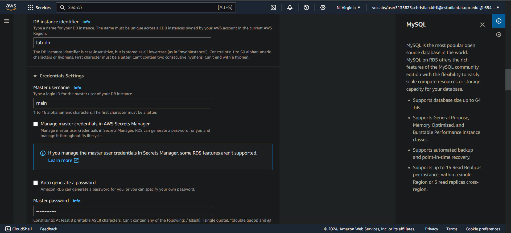

# 2024-4-4
Repo for 2024-4-4. Christian Biffi, Johannes Kari Solmundarson

## Task 4.1: Networking and Content Delivery

We learned about the Amazon VPC and some basics about networking to see how Amazon VPC abstracts some concepts related to the network. 
Learning about the IPv4 protocols and the CIDR notation showed us how we can partition a 
VPC into subnets. Most interesting was the distinction between private and public subnets, and how you need a NAT gateway to be able to connect to the internet
from a private subnet. 

We also learned about the vpc security and how Amazon recommends to add security groups to subnets, rather than use ACR's to create 
firewall rules. By default, the firewall rules allow all incoming communication, and we apply access control by using security groups, either
on the subnet, or on the instances themselves. I think this is a good approach because it forces you to always think about the security of your 
instances and not rely on some firewall upstream that might be circumvented. 

Finally, we learned about Route 53 that is a DNS service that tries to direct network activity to resources that are close to 
the client. This improves latency of the responses, but on top of that, CloudFront is a service that cashes content at edge locations
so to minimize the distance even further between the user and the content. 

## Task 4.2: AWS Lambda

In this activity we learned how to create cloud functions that can be triggered by an external event.

First of all we can create a new function adding all the necessary configuration, in particular the most important one is the runtime where we can choose from different programming languages such as Node, Python, Java and others. For this particular example we are using Python 3.11 and a custom role to execute the function.

  
Click to toggle image

  
  
  

At this point we can create a trigger that will execute the function at 1 minute interval. Here we can create more complex CRON jobs that can trigger the function at specific time interval or time of the day.

  
Click to toggle image

  
  

Now we can finally add the actual code of our function. We can see that this code takes the instance id of a running EC2 instance and stops it. We have taken the correct id of the instance by searching for EC2 service on the AWS console, where there was a pre-created instance running for this laboratory.

  
Click to toggle image

  
  
  

If we try to restart the instance that was stopped by the Lambda function we can see that shortly it will be stopped again. This because we set up the trigger to call the function every minute.

Finally, we can see that AWS provide a "monitor" tab to analyze all the metrics relative to our function, such as the number of invocation, the duration and the error count.

  
Click to toggle image

  
  

## Task 4.3: AWS Elastic Beanstalk

The main objective of this activity was to understand how AWS Beanstalk works for the deployment of web applications.
The laboratory provides a pre-created AWS Beanstalk environment that we can analyze in all of its components and configuration.

We can see that accessing to the domain link of our Beanstalk instance gives us a 404 error, this because even if our instance is working correctly we didn't upload any application to it.

  
Click to toggle image

  
  
  

If we now proceed to download the tomcat application from the link provided by AWS, we can deploy it on our instance and see that now going back to the domain link everything is working correclty.

  
Click to toggle image

  
  
  

From now on, the activity left us the freedom to explore all the possibilities that are present with Beanstalk. In particular, we can see that our instance does not have a database deployed because it does not need it, but can be easily added to it through the networking, database, and tags panel. Moreover, we can, as most of the AWS services, monitor the metrics of our instance to see if everything is working correctly.

Finally, we can see that exploring the EC2 instances created by the lab, are created also other resources such as a security group, a load balancer and an auto-scaling group. 

## Task 4.4: Databases

The goals of the training for Module 8 - Databases, was to understand the different database services that Amazon, especially the managed services and the fundamental difference between SQL and NoSQL. 

Unmanaged services are typically databases that you deploy on EC2 instances. In these cases you are responsible for all availability, replication and encryption concerns. The managed solutions take care most of these concerns, allowing the customer to focus on optimizing the database for the application. 

The managed services that were presented were all Relational except Amazon DynamoDB. DynamoDB is a key-value store that scales horizontally and tackles the 3V's of Big Data, volume, velocity and variety. The biggest difference of DynamoDB compared to the Relational Model, is that there is no schema allowing for heterogeneous data to be stored. 

The other managed services were Amazon RDS, Amazon Redshift and Amazon Aurora. RDS and Aurora are both relational database services but RDS offers more database engines than Aurora, and Aurora is more resilient to failures than RDS. Aurora typically has a recovery time of 60s! 

Amazon Redshift is a managed Data warehouse solution, specifically tuned for high read workloads. It achieves great latency by parallelize data and compute to a high degree. 

 
 

The lab session was focused on getting a practical approach in the deployment of a database using the AWS cloud. We deployed a database in two different availability zones to ensure high availability.

First of all, we have created a specific security group for the database with an inbound rule that allows the incoming traffic from any EC2 instance associated with the "Web Security Group"

  
Click to toggle image

  
  

Then we created a DB subnet group, that is used to tell RDS which subnets can be used for the database. We are choosing two different subnets that are in two different availability zones.

  
Click to toggle image

  
  

Now we can create our database. Since we are using two availability zones to ensure high availability, just like a production database, we need to create it with a "Multi-AZ deployment". This will automatically create a primary DB instance and all the data in it will synchronously be replicated on a standby instance in a different availability zone.
We can see how there are a lot of possible configuration before creating the database, in particular the ones that we are interested in are: set it as "Multi-AZ DB instance", set the "Lab VPC" as Virtual Private Cloud, set the "DB security group" that we created before and turn off automatic backups and encryption (this last point just to have a faster deployment for the lab).

  
Click to toggle image

  
  
  
  
  
  
  

Lastly, we need to connect the EC2 instance that is already pre-deployed by the lab to the database instance that we have just created. In order to do this we just need to access using the ip address to the EC2 instance and under the tab RDS configure the endpoint of our database as well as the username and password that we have set at the creation of it.

  
Click to toggle image

  
  

We can now see that our database is connected successfully, and we can add or remove contacts from it. Notice that all the data that we insert, remove or modify is synchronously changed also in the "secondary" database on the other availability zone.

  
Click to toggle image

  

## Task 4.5: Cloud Architecture

In this module we went over the 6 pillars of the Well-Architected Framework. Most of the pillars were really familiar like Operational excellence, Reliability and Cost Optimization. How you can achieve results within these pillars was the focus point of many of the modules that came before this one. 

Of course Security had its own module, but the term Security in depth, really clicked for us and how it differs from just securing the perimeter of the network for example. 

The performance efficiency pillar relates to choosing the right types and sizes for the business requirements of the system. The line between cost optimization and performance efficiency is a little bit blurry, because if you are creating unnecessary large instances it does affect your cost negatively without providing any benefit. This pillar is more on the technical side of this issue and is more for IT management. 

## Task 4.6: Auto Scaling and Monitoring

In this module we learned how to handle, monitor and distribute the traffic among different instances of EC2 by using the services provided by AWS.

The first service that we can use is the Elastic Load Balancer that allow us to distribute the incoming traffic among multiple instances in one or more availability zones. We can have three different types of load balancer: the first is the application load balancer that works at the application level and routes the target to targets based on the content of the request, the second one is the network load balancer that operates at the network transport level, and it works well both for TCP and UDP. The third option is the classic load balancer that provides basic load balancing across multiple EC2 instances.

The second service presented in this section is Amazon CloudWatch, that is used to monitor, collect and track information about the AWS resources that we are using. With this service we can create alarms to monitor metrics in our account and send notification using Amazon Simple Notification Service or perform an autoscaling of the resources.

The third and last service is the EC2 auto-scaling feature, this enables to automatically add or remove EC2 instances based on the conditions that we decide. This is really useful for instance for an ecommerce that during the Christmas period experience a higher load than usual, with this service active there will be no problem at all, otherwise we should plan for the traffic increase and create new instances ahead potentially wasting resources.

 
 

For the lab session, the goal was to familiarize with scale and load balancing of AWS application.

The load balance creates new instances from an AMI, so we started by creating an AMI from an EC2 that was already running. 

  
Click to toggle image

  

We then proceed to create a Launch Template that specifies what instances for an Auto Scaling Group. We chose a t2.micro instance with the AMI that we just created. Using this template we configured an Auto Scaling Group to have a desired amount of instances of 2 and a maximum of 6. 

We attached to the Auto Scaling Group an Application Load Balancer that we created that balances traffic to both public subnets that we have. We enabled metric collection with Cloud Watch. 

  
Click to toggle image

  
  

Because we enabled Cloud Watch we could see, when we performed a load test on our Load Balancer. We saw how the cpu utilization rose, and how in response, the Auto Scaling Group created more EC2 instances in response. 

  
Click to toggle image

  
  

