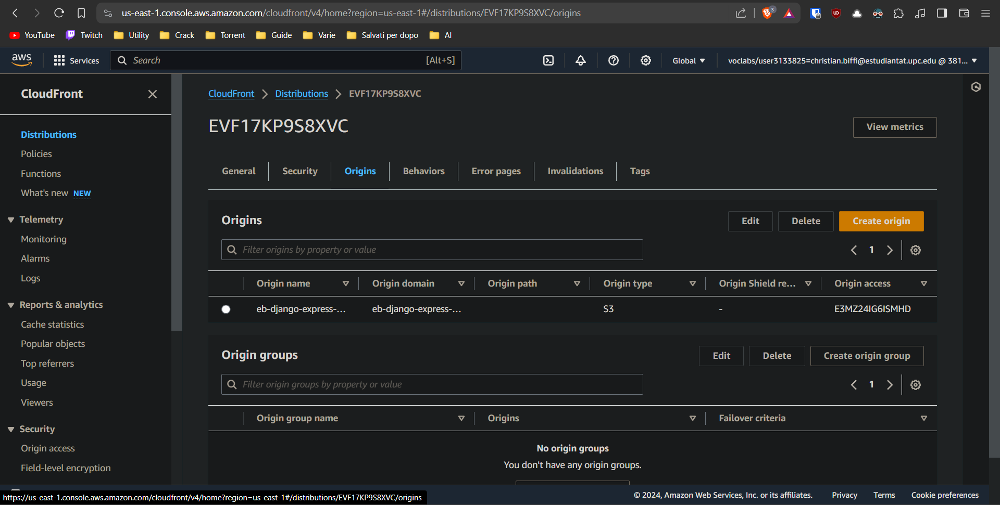
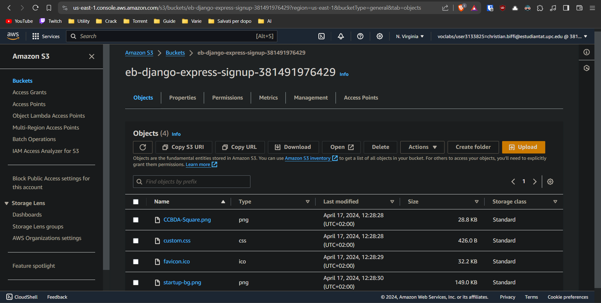
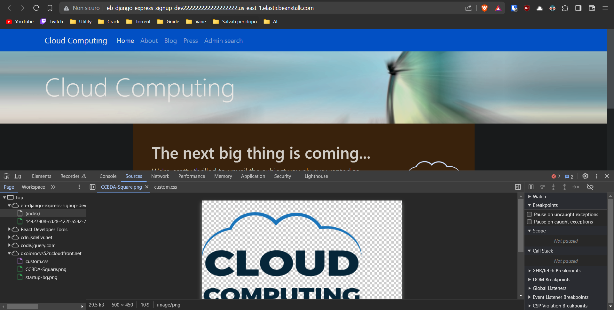

# 2024-5-15

Christian Biffi ([christian.biffi@estudiantat.upc.edu](mailto:christian.biffi@estudiantat.upc.edu)) and Victor Gonzalez ([victor.gonzalez.monge@estudiantat.upc.edu](mailto:victor.gonzalez.monge@estudiantat.upc.edu))

## Task 5.1 and 5.2
For the first tasks of donwloading the code and installing the AWS and EB CLIs there where no complications. After this step we proceeded to create the table in Dynamo DB using the default settings for it.

## Task 5.3
For this task, our objective was to successfully test the web app while running it locally. First, we extracted the necessary environment variables from the AWS console. After this, we proceeded to create a virtual environment using PyCharm, where we set the environment variables extracted previously and set the run/configuration to use Django. 

The settings can be seen in the image below:

  
Click to toggle image

  

One consideration was that every time we restarted the AWS Academy lab session, we would need to change the access environment variables, which was easily managed thanks to PyCharm.

One of the complications that arose during this process was setting the environment in the correct directory so the files would be retrieved correctly, but after a few adjustments, it was done successfully.

We decided to test the web page by adding a user into it, and as can be seen in the following images, the user was correctly added to the table:

  
Click to toggle image

  

## Task 5.4

For this task, we managed to launch an Elastic Beanstalk environment to manage our web application. The first thing we did was set the access environment variables in the credentials file of the AWS configuration files so they were available when creating the environment. After that, we tried to create the environment running the `eb init -i` line, but we got an error indicating the authentication tokens were not valid and prompted us to introduce a valid token, but it did not work.

We managed to solve the issue by using a profile, running the line `eb init --profile default`, and created and tested the environment, as shown in the following images:

  
Click to toggle image

  

#### Q51a
After ensuring the environment worked correctly, we proceeded to terminate the available instance, observing how another instance was created before removing the first one. This is due to the Auto Scaling group Elastic Beanstalk has, which ensures there is always an instance running. 
This can be observed in more detail in the following images:

  
Click to toggle image

  

#### Q51b
To save expenses, we can terminate the EB environment. When terminating the environment, no new instances were created, as EB was responsible for that, and it was closed successfully, along with all the resources it used.
#### Q51c
The application can be terminated using the `eb terminate` command.
#### Q51d
The `eb create` command was not used in this lab.

## Task 5.5
For this task, we set up our application to send an email notification using the AWS Simple Notification Service. Following the tutorial, the modifications to the code were done and the AWS Simple Notification Service was set. There was a problem where the variable for the `NEW_SIGNUP_TOPIC` was not set correctly, but this was quickly rectified.

## Task 5.6

In this task we are going to implement a search functionality of the different users that subscribed to our website.

First of all, we need to add a new path in the urls of our website, then we can use the code provided in the assignment to implement the controller for our new page. In particular the controller will retrieve all the data form our DynamoDB instance, filtering them with two possibilities:
- Interested user or not interested
- Filtering by email domain

We can set these two parameters to filter the data as we want or leave them empty to see the complete list of records.

Then we can use the second code snippet provided to implement the actual function that will fetch the database. We can notice that it is calling the service `dynamodb` passing all the tokens stored in our environmental variables. Here we can also see the actual code used to filter the data using the parameters that we have set previously.

As last thing, we need to move the `search.html` file to the right folder in order to make the page content load correctly.
Modifying the html file we can add an item to the navbar that is linked to the new search page that we have just added.

The adding of the search page worked correctly as well as the filtering of the data. We had just an error the first time we opened the search page because when testing the correct functionality of the previous sections we added some records with a string without a _@_ inside the email field. This case creates an error in the code since it is expecting a _@_ inside that field, but after having deleted the records from the DynamoDB and added some records formatted correctly everything has worked perfectly.
We had to slightly change also the adding in the `navbar`, since pasting the code as it is stated in the assignment will create a duplicated navbar, so we just paste the latest `<ul>` tag that was missing from the previous code.

## Task 5.8
In this part the goal is to transfer the static assets that currently are loaded directly from the web application server to a _Content Delivery Network_, so that the web server won't be overloaded and the loading of the website will be faster.

We start by adding `custom.css` file to our web page html, this enhances the page by adding some images in it that are contained inside the `static/` folder.

To make it work with the AWS Cloudfront we need to first of all create an S3 bucket as we have already seen in the previous laboratories. We need to make sure that the bucket is allowed to be accessed publicly, so that we will be able to load the images from our website.
After having created the bucket we need to upload all the static assets to the bucket. We can do this both manually through the AWS console or, we can use the AWS CLI to set up the syncing between our `static/` folder and the bucket that we have just created.

Then, following the AWS tutorial on how to create the first CDN we select as our origin domain, the bucket that we have created. After having created the distribution we need to upload the policy of our bucket so that the CDN will be able to distribute the content, this operation in very simple since everything that is needed is generated directly by AWS and we need to just copy and paste it in the Bucket Policy.

At this point we wait for Cloudfront to distribute correctly the content, and we can use the domain name assigned to our distribution, followed by one of the file that we have uploaded in our bucket to have access to it.

Now we can modify our code in order to make it load the assets from the CDN and not anymore from the `static/` folder.

These are some images showing the correct loading of the assets from our bucket:

  
Click to toggle image

  
  
  
  

As we can see from the last image, the source of our assets is the address of the CDN.

## Conclusion
This laboratory was particularly hard and with a lot of different problem to resolve. Mainly they were all caused by wrong configuration of the environmental variables or misconfiguration of the eb environment or AWS CLI. 
It was certainly useful to understand better how the AWS services works and how it is possible to manage everything from the AWS CLI.

In total this laboratory took us about 12 hours of works for each one of us.
