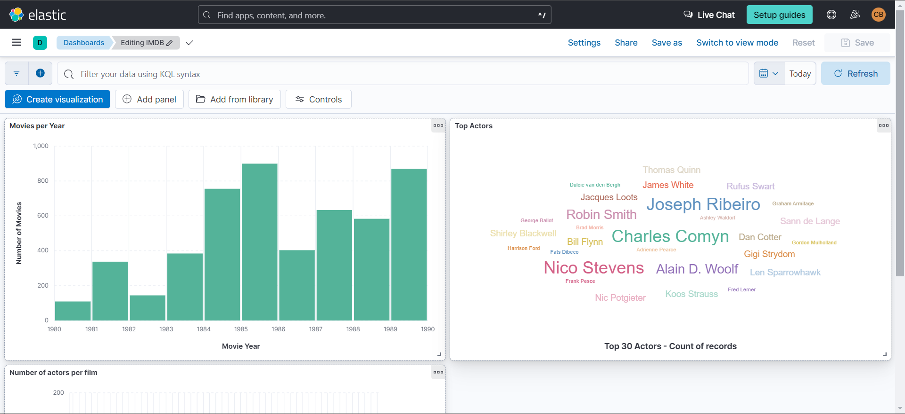
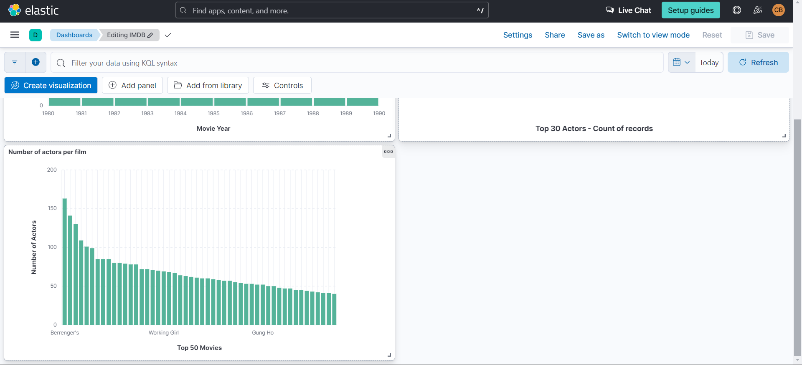
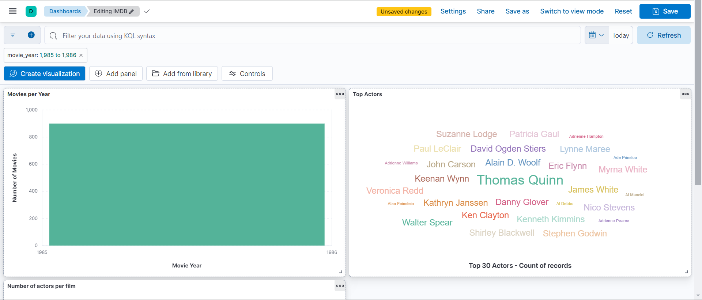
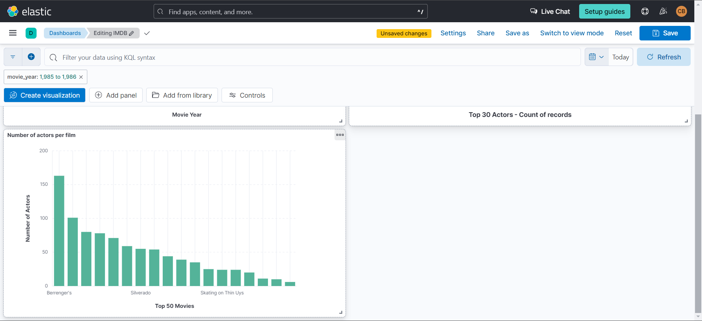
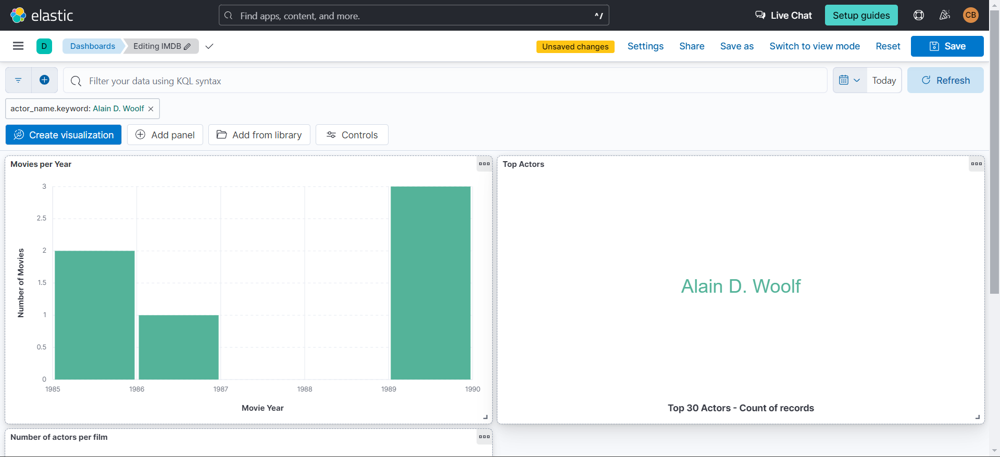
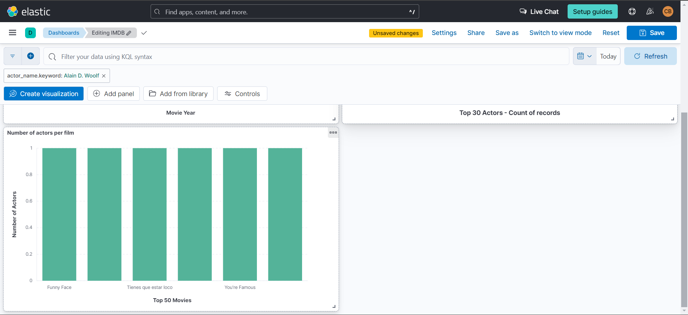
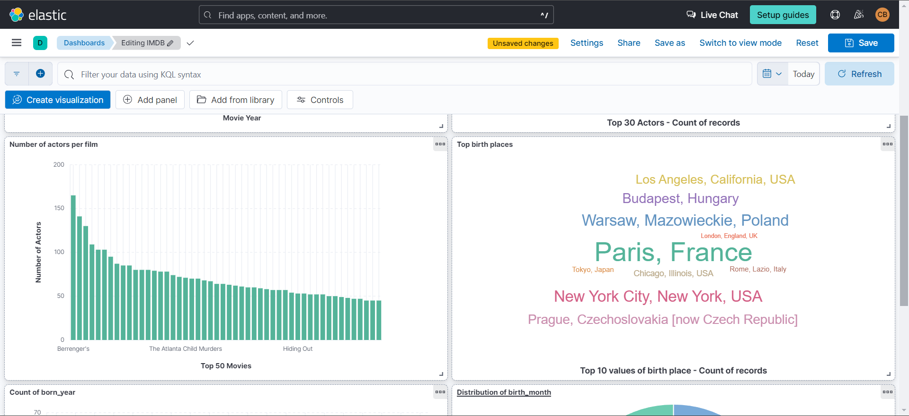
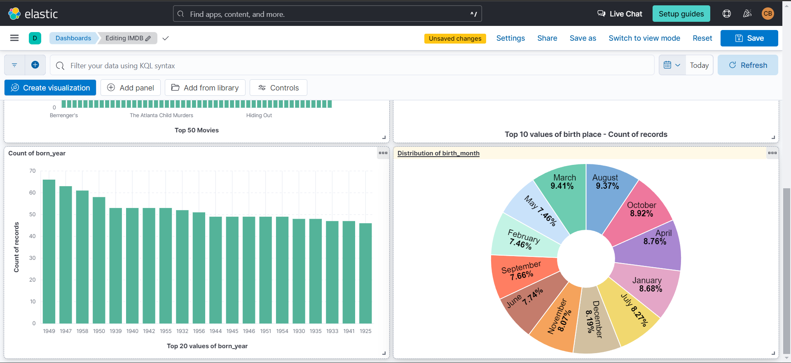

# Report

## Task 6.1

For this task, we first needed to understand how the New York Times website was structured. In particular, starting from the homepage of the website, we can get the section name, the URL where the section appears, the title of the article, the URL of the article, and a summary of the article.  The data is fetched using a Scrapy spider, which navigates through the website's sections and articles. The spider starts from the homepage and iterates over each section. For each section, it iterates over the articles, extracting the required information.

The extracted information is then cleaned using a lambda function cleanString that removes any extra spaces and decodes any non-ASCII characters.  After fetching this basic data, the spider navigates to the article page and fetches the authors of the article.  This process is repeated in a loop, fetching the full data for all the articles on the homepage of the New York Times website.

This is an example of the data fetched using our codebase:
```json

{
  "section": "New York Times - Top Stories",
  "appears_url": "https://www.nytimes.com/",
  "title": "Netanyahu Calls Strike That Killed 7 Aid Workers 'Tragic' and Unintentional",
  "article_url": "https://www.nytimes.com/2024/04/02/world/middleeast/netanyahu-strike-aid-workers.html",
  "summary": "Prime Minister Benjamin Netanyahu of Israel called the airstrike that killed seven aid workers 'tragic' and 'unintentional.'",
  "authors": "Adam Rasgon, Aaron Boxerman"
}
  ```

## Task 6.2

For this task we first needed to understand how the imdb website was structured.
In particular, starting from the full-cast page of a specific film we can get the film name, the year of the production, and we have the list of all the actors that have a role in the film. The list of the actors are inside a table and from that we can iterate on each row of the table taking the `<td>` tag. From that we can take the name of the actor and the name of the role that is playing in that specific film.

After fetching this basic data, we can navigate to the actor page and find the list of films it has participated in. From the list of films we can then again visit the corresponding page of each film and take the full actor list. 
We repeat this process in loop, fetching the full data only for films between 1980 and 1990 as requested by the assignment.

This is an example of data fetched using our codebase:
```json
[
    {"movie_id": "tt0096463", "movie_name": "Working Girl", "movie_year": 1988, "actor_name": "Harrison Ford", "actor_id": "nm0000148", "role_name": "Jack Trainer"},
    {"movie_id": "tt0096463", "movie_name": "Working Girl", "movie_year": 1988, "actor_name": "Sigourney Weaver", "actor_id": "nm0000244", "role_name": "Katharine Parker"},
    {"movie_id": "tt0096463", "movie_name": "Working Girl", "movie_year": 1988, "actor_name": "Melanie Griffith", "actor_id": "nm0000429", "role_name": "Tess McGill"},
    {"movie_id": "tt0096463", "movie_name": "Working Girl", "movie_year": 1988, "actor_name": "Alec Baldwin", "actor_id": "nm0000285", "role_name": "Mick Dugan"}
]
```

## Task 6.3

In order to upload the data gathered with the scraper we needed to connect to Elasticsearch using their API. Some of the API function has changed from the instruction of the assignment, so to adapt to the latest API version we have read the documentation to understand how to connect with the API and how to upload data.
In particular with the new version of the API we just need the API URL with the port and the API Key generated inside the dashboard of Elasticsearch.
To get the API URL and API Key we created a `.env` file with the corresponding values, and we are loading them using the `dotenv` library.

Also the function to upload the data has changed a bit from the example on the assignment, now there is no need to specify the `doc_type` parameter, but is enough to specify the `index`, `id` and `body` with the actual data that we want to upload.

Updating the code from the previous task with these new parts of code we are able to upload the data fetched from imdb directly to Elasticsearch.

At this point we can visualize the data inside our dashboard and we can use them to explore and create graphs using Kibana.

These are some screenshots of the dashboard with the three graphs requested:

<details>
  <summary>Click to toggle image</summary>
  
  
  
</details>

We can also add some filters to the data and see that the graphs change accordingly, in particular we can select a specific year and see the graphs relative to it:
<details>
  <summary>Click to toggle image</summary>
  
  
  
</details>

This is another example of an active filter where we have selected a specific actor:
<details>
  <summary>Click to toggle image</summary>
  
  
  
</details>

<br><br>

As for the last part of this assignment, we modified the previous code in order to scrape also personal detail of the actors, such as the _birth_place_, _birth_year_, _birth_month_, _birth_day_ and the _height_.

This part was a little bit tricky because of missing information in the actors pages or that have a different formatting. For instance, in some pages is present only the _birth_year_ and not the _birth_month_ and _birth_day_, or in other is not present at all the _birth_place_.
We tried our best to create a code that handles the majority of the cases, but still are present some cases that we weren't able to handle with a single function.

In conclusion, we created three other different graphs, the first one is a tag cloud with the 10 most common _birth_place_, the second one is a bar graph that shows the count of _birth_year_ and the last one is a pie chart with the distribution of _birth_month_ between the actors.

<details>
  <summary>Click to toggle image</summary>
  
  
  
</details>

## Conclusion
This laboratory was very challenging for us, in particular because of understanding how to correctly take the information that we needed from the two websites. At first, we had some problem also with the uploading of the data to Elasticsearch, mainly because the API have changed and are different from what was provided as example in the lab assignment, but after reading the API documentation and with some research on the internet we found out the correct way of using them.

In total, we have spent about 12 hours working on this lab.