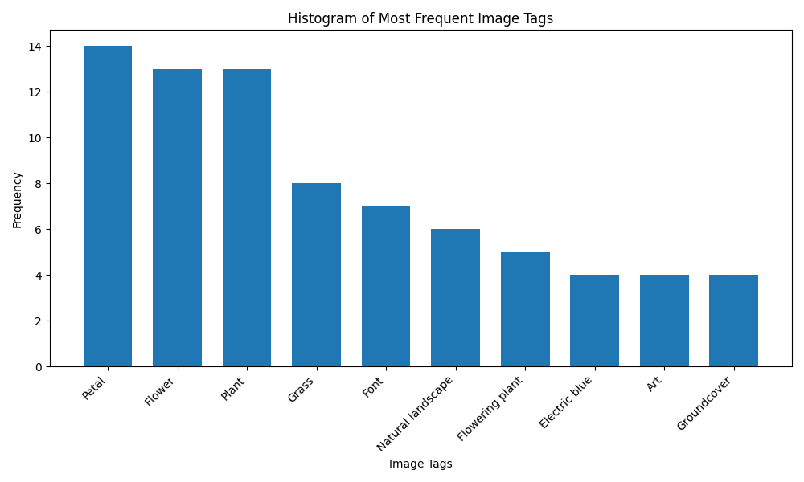

# 2024-7-5

In this Lab session, we experimented with the power of the Cloud Vision API from Google to detect text within images as an example of Advanced Analytics as a Service in the Cloud.

To be able to scrape the images from websites we used _scrapy_ library as we have seen in the previous laboratories. First of all, we scrape the website to get the direct link to the image and use it to download the image in a temporary directory (we are also renaming the images to avoid some errors that occured with the original names of the scaraped images).

After this, for each of the images scraped, we use the Cloud Vision API to get back the labels detected in the corresponding image, saving them. With the data gathered from the API call we can plot what are the most common labels detected in the images.

## Setup

Install dependencies

```sh
$ python -m venv venv
$ source venv/bin/activate
$ pip install -r requirements.txt
```

Run the script

```sh
$ python ImageAnalyzer.py <url>
```

## Results

By running the script on [unslpash.com](https://unsplash.com) we obtained the following histogram



## Questions

**Q81:**

Developing the code itself was the "easy" part, and posed few challenges. The most difficult part about the code was to understand how the latest version of the API worked, but after reading the documentation and with a couple of tentatives everything worked fine. Another "difficult" task we encountered was getting the necesarry credentials and enabling billing. Google security flagged the attempts by one of us as suspicious, leading to a temporary ban.

**Q82:**

In total we spent roughly 8 hours. The main difficulties was working with Google, but all in all a fairly uncomplicated lab beyond the initial setup.
