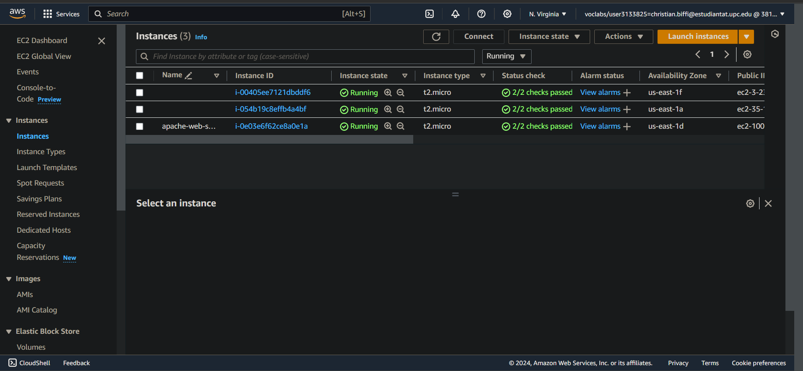
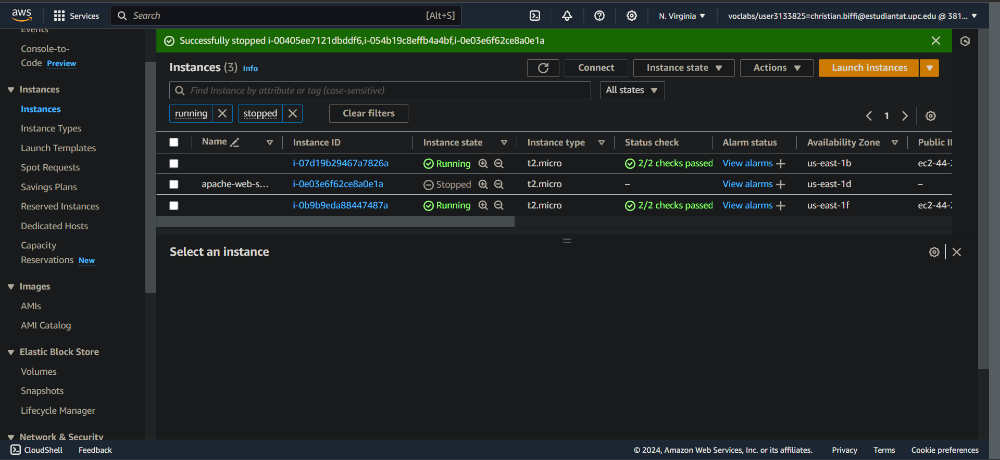

# 2024-8-5

In this lab we are implementing a load balancer that directs the traffic to our web server. 

Following the istruction provided in the assignment we were able to create the EC2 instance with the corresponding security group and connect to it correctly using the ip address of the EC2 instance. In order to make it correctly work and void the connection timed out error, we need to specify the port `80` after the ip address.

The following step was to create the load balancer for our application, in this part we had some problems with the creation and use of the certificate. In particular we need to specify a CN (Common Name) that has the form of a website address (i.e. `myserver.info`) otherwise the certificate won't work. Morover, we needed to remove the _HTTP_ protocol from the load balancer and keep just _HTTPS_, because the certificate is only working with _HTTPS_.

After testing that also the load balancer was working correctly, we updated the security group policy for the web server to allow the connection coming from the load balancer.
Subsequently we connected through ssh to our EC2 instance to modify the content of the web page. In particular one of us since was using Windows used the free tool _PuTTY_ to create a SSH connection with the server, using the key pair specified at the moment of creation of the EC2 instance.

We then proceeded to create the AMI starting from the EC2 instance that we have configurated. After having done this, we can use the AMI as a starting image for our auto scaling group.
When we save the auto scaling group, we can notice that 2 other instances have been created with the AMI provided.

  
Click to toggle image

    

### Questions

**Q811**  
If we try to use http://your-load-balancer-url instead of  https://your-load-balancer-url we will see that there is a connection refused error. This is caused by the fact that we created the load balancer accepting just the connection coming with _HTTPS_, removing the ones coming with _HTTP_ becuase it does not support the certificate that we have uploaded.

**Q812**  
We can notice that after stopping the three instances, the two that where created with the auto scaling group will be automatically restarted, while the original EC2 instance that we have created, since it is not part of the auto scaling group, will not automatically restart.

  
Click to toggle image

     

**Q813**  
When we terminate the instances, differently from when we stop them, two new instances will be created. The original EC2 instance will not be recreated since it is not part of the auto scaling group.

**Q814**  
This lab took about 6 hours to complete, mostly because we had problems with the certificate and the configurations of the various things. About the AWS resources, we need to be careful when using auto scaling features, since they can automatically create new EC2 instances that could lead to spending a lot of money if not carefully planned.

**Q815**  
We created a script called AutoScript.py to automate the process we went through in this lab. This Python script uses the AWS SDK for Python (Boto3) to automate the deployment of a basic web server architecture on AWS. It includes functions to create security groups, launch an EC2 instance, and set up an application load balancer. The script sequentially creates a secure environment, deploys an EC2 instance within this environment, and distributes incoming traffic via the load balancer.
